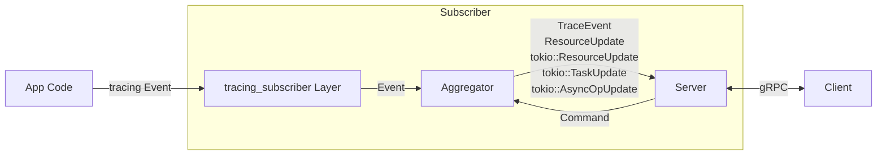

# Architecture

This document describes the architecture of the `devtools` project, how the components fit together and how the data flows through them.

There are two major components: The GUI app (called *Client*) that renders the data in a human readable way and a Rust crate that instruments the Rust application and exports collected data to the *Client* (called *Subscriber*).

The *Client* and *Subscriber* communicate using gRPC and a wire format defined in the [`api`](./api) crate. This communication is **two-way** allowing for interactive control over the *Subscriber*.

## Core paradigms

Below are a few core paradigms that have influenced the design decisions taken so far and should be respected by all new code:

### Interactivity

Contrary to other debugging and profiling tools that record events to a file and then perform processing on it everything in this project is design to run in **realtime** and be **interactive** to allow for user control. I believe this is the only paradigm applicable to the highly interactive and playful nature of web development used for Tauri apps. 

### Processing happens at the *Subscriber*

As much data processing and aggregation should happen at the *Subscriber* side of the gRPC interface. This has several reasons:
- **Recude the amount of data sent** - Sending data across the gRPC interface incurs a serialization overhead, reducing the amount of data sent across the interface improves performance. It also helps with remote-debugging where the *Client* may be on a completely different machine.
- **Reduce the amount of PII sent** - Sending as little raw data that could contain PII (Personally Identifiable Information) or other data that could be used for tracking is just good practice, it reassures the user that we care about their data - something that becomes increasingly important once we offer this as a web frontend for remote debugging.

### Client initiated streams

All data transfers are initiated by the *Client* and should include the possibility for the *Client* to specify a filter. This further helps to reduce the network traffic by only sending information that the *Client* truly cares about.

## Data Flow

## Subscriber

The subscriber hooks into the `tracing` ecosystem to collect the events and spans reported by 3rd party crates. 
These events and spans will be processed and potentially aggregated (note that regular span events are still emitted in realtime currently) over time.
The subscriber exposes a gRPC server that clients can use to request access to this data stream.
