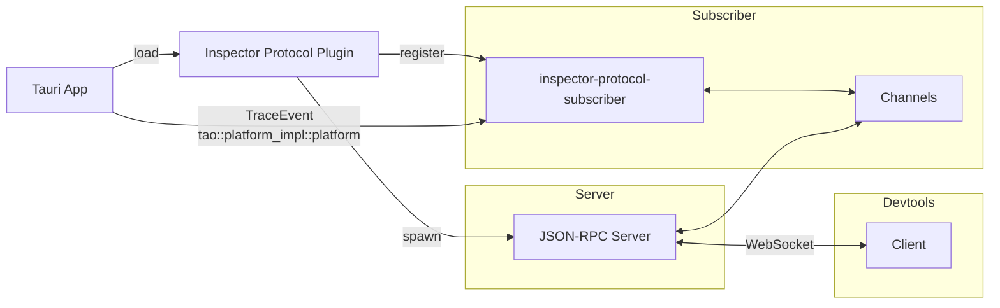

# Architecture

This document offers a detailed overview of the plugin's structural design, its components, and how they interrelate.

## Overview

The Inspector Protocol is fundamentally a Tauri plugin designed for real-time data interaction. Utilizing WebSocket technology, it establishes a JSON-RPC server with subscription capabilities, allowing for dynamic two-way communication. 

Furthermore, with its subscriber component, the protocol can seamlessly integrate with the [`tracing`](https://crates.io/crates/tracing) ecosystem to collate events and spans reported by various third-party crates.

## Components

### **Tauri Plugin**
The heart of the Inspector Protocol, it integrates seamlessly with Tauri applications, allowing developers to supercharge their debugging and monitoring capabilities with minimal effort.

### **Real-time Data Exchange**
Our system prioritizes instantaneous interaction, ensuring data exchange occurs in real-time, without latency.

### **WebSocket (JSON-RPC Server)**
A robust WebSocket layer underpins the protocol, acting as the JSON-RPC server. This ensures:
   - Streamlined two-way communication.
   - Subscription support for more dynamic interactions.

### Subscriber
The subscriber component is adept at tapping into the [`tracing`](https://crates.io/crates/tracing) ecosystem. By doing so, it's able to gather valuable insights, collecting events and spans as reported by third-party crates.

## Repository

Understanding our repository is essential to grasping the Inspector Protocol. Here’s a breakdown of the primary folders:

- **`inspector-protocol`**: This is the main library. Notably, it's the sole crate destined for publication.

- **`primitives`**: This folder houses the fundamental shared types necessary for the Inspector Protocol to function optimally.

- **`server`**: Our dedicated JSON-RPC Server resides here. It features a WebSocket transport layer, which supports connection upgrade, facilitating interactions.

- **`subscriber`**: This component plays a pivotal role as the `tracing` subscriber, continuously monitoring and collecting vital data from the ecosystem.

## WebSocket

In the design, channels serve as the backbone for efficient and immediate data transfer particularly when it comes to real-time broadcasting over WebSockets.

One of the features of this approach is the absence of accumulators or buffers. Instead of stockpiling events, they're immediately broadcasted to all subscribers the moment they arrive. This is facilitated using Tokio's [broadcast](https://docs.rs/tokio/latest/tokio/sync/broadcast/index.html) channel. 

Events are dispatched to the channel **only if there's an active subscription**. This means there's no unnecessary buildup or accumulation of data in the channel if there are no listeners. This dynamic setup helps in keeping the data flow lean and efficient. When events are sent to the channel, they're immediately broadcasted to all subscribers via the WebSocket. This rapid dispatch mechanism ensures that data transfer is nearly instantaneous, maintaining the real-time nature of the protocol.

While the current setup efficiently handles broadcasting without the need for an aggregator, there's still a provision to manage the broadcast channel's capacity. Benchmarking will be crucial to fine-tune this capacity to ensure optimal performance. Although, based on the current design and how events are funneled through the WebSocket channel, the necessity for an aggregator seems minimal.

## Data Flow

