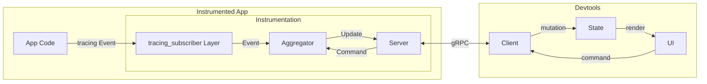

# Developing

There are a couple components to devtools that you should know about:

- `crates/devtools-core` The core instrumentation library that will cappture and process `tracing` data from your app.
- `crates/devtools` The user-facing Tauri plugin that hooks `devtools-core` into a Tauri app.
- `crates/devtools-v1` The Tauri plugin for legacy Tauri v1.x versions
- `crates/wire` The protobuf files that define the message protocol between the instrumentation and GUI.
- `clients/web` The user-facing web GUI that is hosted at `devtools.crabnebula.dev`

## The `cargo-deny` check is failing! What do I do?

The [`cargo-deny`](https://github.com/EmbarkStudios/cargo-deny) action checks for various dependency-related issues,
such as problematic licenses, CVEs and the like. Sometimes when opening a PR this check just fails. It's usually a good
idea to inspect its output to see exactly _why_ the check is failing.

If it's something like, security vulnerabilities chances are high you just need to update the repos lockfiles. You can
do so by running this command from the repo root:

```bash
cargo update && cargo update --manifest-path examples/tauri-v1/Cargo.toml && cargo update --manifest-path crates/v1/Cargo.toml
```

## Developing locally

By default the instrumentation has strict CORS checks enabled to ensure only the legitimate frontend hosted
at `devtools.crabnebula.dev` can access the data, as this would also block the frontend running locally in development
mode (`localhost` doesn't match `devtools.crabnebula.dev`) these checks can be disabled by setting the environment
variable `__DEVTOOLS_LOCAL_DEVELOPMENT=true`. If you run the examples contained within this repo through `cargo` or the
Tauri CLI nothing needs to be done, that environment variable is set automatically.

# Architecture

The core observation behind DevTools is that Tauri apps are _interactive_ and _long-running_ processes,
and being able to gather, aggregate and visualize data _in realtime_ is therefore very important.
I believe this is the only paradigm applicable to the highly interactive and playful nature of web development used for
Tauri apps.

To archive realtime data collection with minimal overhead, DevTools consists of two main components:
The app instrumentation and user-facing UI.

## Core paradigms

Below are a few core paradigms that have influenced the design decisions taken so far and should be respected by all new
code:

### Client initiated streams

All data transfers are initiated by the _Client_ and should include the possibility for the _Client_ to specify a
filter.
This further helps to reduce the network traffic by only sending information that the _Client_ truly cares about.

## Overview



### App Instrumentation

The App Instrumentation is available as a Rust crate and has to be included in the users Tauri app.
The crate exposes a simple interface: `init` and `try_init` which initialize the collection and aggregation systems,
and return a Tauri plugin which has to be added to the app for further integration with Tauri.

The instrumentation collects data from the `tracing`ecosystem, through a `tracing_subscriber` `Layer` and
forwards all events to an `Aggregator` task. This task keeps all the state necessary to run the instrumentation layer
and will ingest events, apply them to its internal state and then periodically send batches of events to all
connected clients through the gRPC `Server`.

It's important to note that both the `Aggregator` and `Server` run in their own OS thread, using their own tokio runtime
and the `Layer` implementation is kept as lightweight as possible as to not distort the measurements and provide a
layer of isolation from the rest of the app.
This also means that a crash in the instrumentation will not bring down the app with it.

The above is exposed through the [`Instrumentation`](./crates/wire/proto/instrument.proto) gRPC service, but there are a
couple more:

#### `Metadata`

This exposes metadata about the Tauri such as the apps name, version, description, but also information
about the Operating System such as Architecture.
For details see the [`Metadata` service definition](./crates/wire/proto/meta.proto).

#### `Sources`

This service lets the UI display a tree-view of the working directory by enumerating files recursively and
querying bytes of a file.
For details see the [`Sources` service definition](./crates/wire/proto/sources.proto).

#### `Tauri`

This service lets the UI access the tauri configuration, tauri and webview versions and tauri-specific performance
metrics that are not yet exposed through the `Instrumentation`.
For details see the [`Tauri` service definition](./crates/wire/proto/tauri.proto).

#### `Health`

This is a standard gRPC service that lets clients query the operational status of the systems services.
