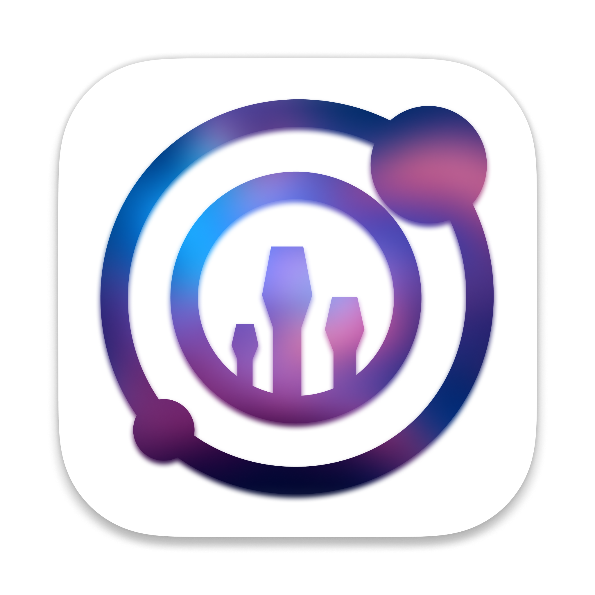
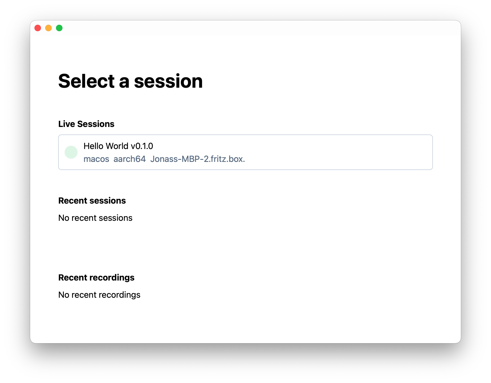

<p align="center">
  
</p>
<h3 align="center"><code>CN devtools</code></h3>
<p align="center">
<strong>Inspect and Debug your Tauri applications in style 💃</strong>
<br />
<strong><i>Work In Progress</i></strong>
<br/>

[](https://opensource.org/licenses/Apache-2.0)

</p>

> **Note**: This project is under active development, features might have big, be only partially implemented or outright missing.
> Almost everything about this project is work in progress even the name! If you're interested in improving the Tauri debug experience:
>
> Contributions are very welcome, get in touch!

## Using CN devtools

This project consists of two parts:

1. Instrumentation Library.
2. Visualization Client.

The Client gathers the data collected by the Instrumentation Library and presents it in a human readable and interactive way. You will need both in order to debug Rust programs.

### Adding the instrumentation library

The instrumentation library can be used like any regular Rust `log` or `tracing` frontend. Add it to your crate's dependencies:

```toml
subscriber = { git = "https://github.com/crabnebula-dev/devtools" }
```

And initialize it in your main function. It is important that you initialize it **as early as possible**

```rust
fn main() {
  let context = tauri::generate_context!();

  subscriber::init(&context);

  tauri::Builder::default()
      .run(context)
      .expect("error while running tauri application");
}
```

### Running the Client

There are 2 prerequisites to run Devtools:

1. [Tauri pre-requisites](https://tauri.app/v1/guides/getting-started/prerequisites): it's a Tauri app.
2. [Protoc](http://google.github.io/proto-lens/installing-protoc.html): it uses protobuf for the messages.

Once the requirements are addressed, clone this repository

```sh
git clone https://github.com/crabnebula-dev/devtools
```

And finally run the client:

```sh
cargo run -p ui
```

Active instrumented apps on your local network will appear in the "Live Sessions" section



## Development and Testing

For developing and testing you can use apps within `/examples`. Those are already instrumentalized and ready to push events to Devtools. E.g.: From the root of this project, change directory into `/examples/test-fixture` and run `cargo tauri dev`.

```sh
cd examples/test-fixture && cargo tauri dev
```

Happy coding! 🎉

## Features

- [ ] Command Performance Profiling
- [ ] Events Console

## Contributing

TODO

#### License

<sup>
Licensed under the <a href="http://www.apache.org/licenses/LICENSE-2.0">Apache License, Version 2.0</a>.
</sup>

<br>

<sub>
Unless you explicitly state otherwise, any contribution intentionally submitted for inclusion in this app by you, as defined in the Apache-2.0 license, shall be licensed as above, without any additional terms or conditions.
</sub>
