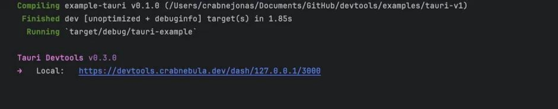

[](https://devtools.crabnebula.dev)

# Devtools for Tauri

Inspect, monitor, and understand your [Tauri](https://tauri.app) application with ease.

- **Easy Integration:** With just a few lines of code, enable detailed event logging and metadata extraction for your application.
- **Rich Insights:** Get insight into what your app is doing, Performance, Errors, Warnings, everything is available at a glance.
- **And more:** This project is actively worked on, and we are open to hear your ideas, check out the [Upcoming Features]() issue for details.

## Getting Started

> [!TIP]
> For the full documentation, check: [docs.crabnebula.dev/devtools](https://docs.crabnebula.dev/devtools)

### Tauri v1

Ensure you have [Tauri](https://tauri.app/v1/guides/getting-started/setup/) set up correctly. Then install the Rust instrumentation from crates.io:

```sh
cargo add devtools
```

You also have to use Tauri **1.5.4** (or later) so your `Cargo.toml` file should look as follows::

```toml
[dependencies]
tauri = "1.5.4"
devtools = "0.3.0"
[build-dependencies]
tauri-build = "1.5.0"
```

The primary export of the devtools crate is a Tauri Plugin that interfaces with the system, therefore you will need to initialize and register the plugin with Tauri itself before you can use the DevTools. To do that, edit your main.rs file like so:

```rust
fn run() {
    let devtools = devtools::init(); // initialize the plugin as early as possible

    tauri::Builder::default()
        .plugin(devtools) // then register it with Tauri
        .run(tauri::generate_context!("./tauri.conf.json"))
        .expect("error while running tauri application");
}
```

> Note: You should disable devtools in production builds, as it bloats your app unnecessarily and poses a possible security risk.

And that’s it! If you run your app now (cargo tauri dev), you will notice the following new output in your terminal:



### Tauri v2

Ensure you have [Tauri](https://beta.tauri.app/guides/create/) set up correctly. Then install the Rust instrumentation from crates.io:

```sh
cargo add tauri-plugin-devtools@2.0.0-beta
```

You also have to use Tauri **2.0.0-beta.1** (or later) so your `Cargo.toml` file should look as follows:

```toml
[dependencies]
tauri-plugin-devtools = { git = "https://github.com/crabnebula-dev/devtools" }
tauri = "2.0.0-beta.3"
[build-dependencies]
tauri-build = "2.0.0-beta"
```

Then add the following snippet to your tauri initialization code:

```rust
fn main() {
    // This should be called as early in the execution of the app as possible
    #[cfg(debug_assertions)] // only enable instrumentation in development builds
    let devtools = tauri_plugin_devtools::init();

    let mut builder = tauri::Builder::default();

    #[cfg(debug_assertions)]
    {
        builder = builder.plugin(devtools);
    }

    builder
        .run(tauri::generate_context!())
        .expect("error while running tauri application");
}
```

And then run your app as usual, if everything is set up correctly devtools will print the following message:


You can click or copy & paste the link into your browser to open up the UI.
Alternatively you can navigate to https://devtools.crabnebula.dev and connect from there.

### Usage with other logging systems

If you're running the DevTools plugin next to another tracing or logging system, you will face a crash
stating you cannot define multiple logging systems on the same process:

```
thread 'main' panicked at src/main.rs:24:10:
error while running tauri application: PluginInitialization("log", "attempted to set a logger after the logging system was already initialized")
note: run with `RUST_BACKTRACE=1` environment variable to display a backtrace
```

An alternative is to use tauri-plugin-devtools in debug builds (`tauri dev` and `tauri build --debug` modes)
and use a separate logging system in production (such as `fern` or `tauri-plugin-log`) letting you persist logs or have custom functionality:

```rust
fn run() {
    let mut builder = tauri::Builder::default();

    #[cfg(debug_assertions)]
    {
        let devtools = tauri_plugin_devtools::init();
        builder = builder.plugin(devtools);
    }

    #[cfg(not(debug_assertions))]
    {
        use tauri_plugin_log::{Builder, Target, TargetKind};

        let log_plugin = Builder::default()
            .targets([
                Target::new(TargetKind::Stdout),
                Target::new(TargetKind::LogDir { file_name: None }),
                Target::new(TargetKind::Webview),
            ])
            .build();

        builder = builder.plugin(log_plugin);
    }

    builder
        .run(tauri::generate_context!())
        .expect("error while running tauri application");
}
```

Another approach is to pipe other logging system through `tauri-plugin-devtools` via the `attach_logger` function,
which register the logging system to receive log records propagated by this plugin's tracing subscriber.
The following snippet demonstrates how to use the `attach_logger` function for compatibility between
`tauri-plugin-devtools` and `tauri-plugin-log`:

```rust
fn run() {
    tauri::Builder::default()
        .setup(|app| {
            // create the log plugin as usual, but call split() instead of build()
            let (tauri_plugin_log, max_level, logger) = tauri_plugin_log::Builder::new().split(app.handle())?;

            // on debug builds, set up the DevTools plugin and pipe the logger from tauri-plugin-log
            #[cfg(debug_assertions)]
            {
                let mut devtools_builder = tauri_plugin_devtools::Builder::default();
                devtools_builder.attach_logger(logger);
                app.handle().plugin(devtools_builder.init())?;
            }
            // on release builds, only attach the logger from tauri-plugin-log
            #[cfg(not(debug_assertions))]
            {
                tauri_plugin_log::attach_logger(max_level, logger);
            }

            app.handle().plugin(tauri_plugin_log)?;

            Ok(())
        })
}
```

### Android

The Android emulator runs behind a virtual router that isolates it from the development machine network interfaces.
To access the WebSocket server started by the Devtools on your machine, you must set up network redirection:

- Via adb:

```
adb forward tcp:3000 tcp:3000
```

- Via the emulator console:

```sh
# first emulator launches on port 5554, you might need to find out the port via `$ adb devices`
telnet localhost 5554
auth <insert-auth-token-here> # insert token from `$HOME/.emulator_console_auth_token`
# redirect host connections to 3000 to emulator port 3000
redir add tcp:3000:3000
```

For more information, see the [official documentation](https://developer.android.com/studio/run/emulator-networking#redirection).

## Features

### Console

The Console tab lets you quickly and conveniently see what your app is doing.
Any errors, warnings or other messages produced by your code, Tauri or your dependencies will show up here.

### Calls

Commands are at the core of your Tauri app, and the Calls tab is designed to let you debug and troubleshoot any
issues that you might have. It will display arguments and returns for each command as well as a detailed performance
breakdown of exactly how much processing time your command spent on what.

### Config Viewer

The Config Viewer will present you with a detailed breakdown of your Tauri configuration and in the future also include
warnings, tips and hints.

## License

The Instrumentation (i.e. the folders `/wire` and `/devtools`) is licensed under either of [Apache License, Version 2.0](./LICENSES/Apache-2.0.md) or [MIT license](./LICENSES/MIT.md) at your option.

All other code is licensed under the [PolyForm Noncommercial License 1.0.0](./LICENSES/Polyform-Noncommercial.md).

> ⚠️ Unless you explicitly state otherwise, any contribution intentionally submitted for inclusion in this project by you, shall be licensed as above, without any additional terms or conditions.
