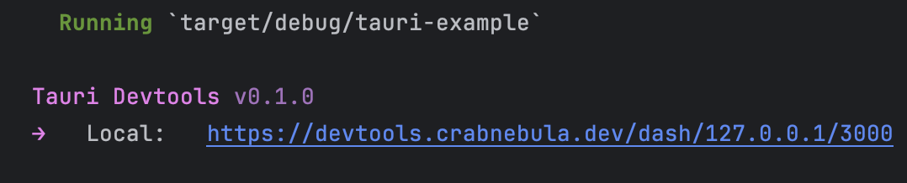

# Tauri Devtools

Inspect, monitor, and understand your [Tauri](https://tauri.app) application with ease.

- **Easy Integration:** With just a few lines of code, enable detailed event logging and metadata extraction for your application.
- **Rich Insights:** Get insight into what your app is doing, Performance, Errors, Warnings, everything is available at a glance.
- **And more:** This project is actively worked on, and we are open to hear your ideas, check out the [Upcoming Features]() issue for details.

## Getting Started

Ensure you have [Tauri](https://tauri.app/v1/guides/getting-started/setup/) set up correctly. Then install the Rust instrumentation from crates.io:

```sh
cargo add devtools
```

Since we're using recent additions to Tauri that haven't yet been published to crates.io you will have adjust your 
`Cargo.toml` file so that Tauri is downloaded from git:

```toml
[dependencies]
tauri-devtools = "0.1.0"
tauri = { git = "https://github.com/tauri-apps/tauri" }

[build-dependencies]
tauri-build = { git = "https://github.com/tauri-apps/tauri" }
```

Then add the following snippet to your tauri initialization code:

```rust
fn main() {
    #[cfg(debug_assertions)] // only enable instrumentation in development builds
    let devtools = tauri_devtools::init();

    let builder = tauri::Builder::default();

    #[cfg(debug_assertions)]
    let builder = builder.plugin(devtools);

    builder
        .run(tauri::generate_context!("./tauri.conf.json"))
        .expect("error while running tauri application");
}
```
 
And then run your app as usual, if everything is set up correctly devtools will print the following message:



You can click or copy & paste the link into your browser to open up the UI. 
Alternatively you can navigate to https://devtools.crabnebula.dev and connect from there.

## Features

### Console

The Console tab lets you quickly and conveniently see what your app is doing. 
Any errors, warnings or other messages produced by your code, Tauri or your dependencies will show up here.

### Calls

Commands are at the core of your Tauri app, and the Calls tab is designed to let you debug and troubleshoot any 
issues that you might have. It will display arguments and returns for each command as well as a detailed performance
breakdown of exactly how much processing time your command spent on what.

### Config Viewer

The Config Viewer will present you with a detailed breakdown of your Tauri configuration and in the future also include 
warnings, tips and hints.

## License

<sup>

The Instrumentation (i.e. the folders `/wire` and `/devtools`) is licensed under either
of [Apache License, Version 2.0](./LICENSES/Apache-2.0.md) or [MIT license](./LICENSES/MIT.md)  at your option.

All other code is licensed under the [PolyForm Noncommercial License 1.0.0](./LICENSES/Polyform-Noncommercial.md).

</sup>

<br>

<sub>
Unless you explicitly state otherwise, any contribution intentionally submitted
for inclusion in this project by you, shall be licensed as above, without any 
additional terms or conditions.
</sub>
